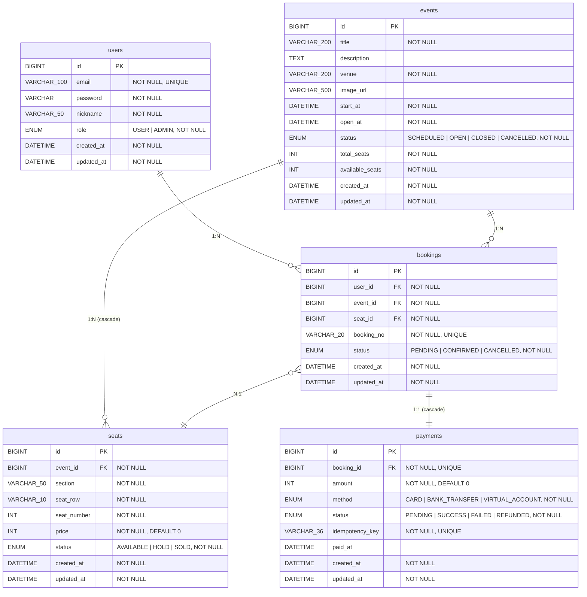

# Database ERD

## 제약 조건 정리

| 테이블 | 제약 | 설명 |
|--------|------|------|
| `seats` | UNIQUE(event_id, section, seat_row, seat_number) | 동일 이벤트 내 좌석 중복 방지 |
| `bookings` | UNIQUE(booking_no) | 예매번호 전역 유일 |
| `payments` | UNIQUE(booking_id) | 예매당 결제 1건 보장 (1:1) |
| `payments` | UNIQUE(idempotency_key) | 결제 중복 방지 (멱등성 키) |
| `users` | UNIQUE(email) | 이메일 중복 가입 방지 |

## 관계 요약

| 관계 | 카디널리티 | 비고 |
|------|-----------|------|
| users → bookings | 1:N | 한 유저가 여러 예매 보유 |
| events → seats | 1:N | 한 이벤트에 여러 좌석, cascade ALL |
| events → bookings | 1:N | 한 이벤트에 여러 예매 |
| seats → bookings | 1:N | 한 좌석이 여러 예매(취소 후 재예매) |
| bookings → payments | 1:1 | 예매당 결제 1건, cascade ALL |
