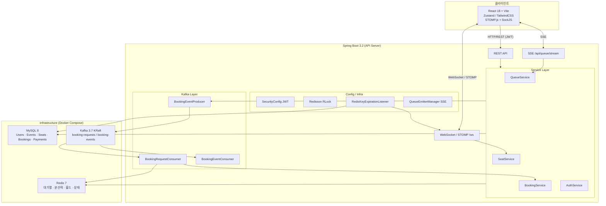
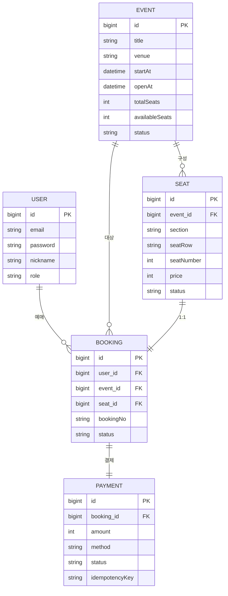

# 시스템 아키텍처

> 이 문서는 실시간 티켓팅 시스템의 전체 구성과 주요 저장소, 메시징, 포트 구조를 한 번에 훑기 위한 문서입니다.

| 빠른 정보 | 내용 |
|-----------|------|
| 목적 | 프론트엔드, API, Redis, MySQL, Kafka, 모니터링 구성을 한 장으로 설명 |
| 먼저 볼 것 | 전체 구성도, Redis 키 구조, Kafka 토픽 설계 |
| 함께 읽을 문서 | [서비스 플로우](service-flow.md), [시퀀스 다이어그램](sequence-diagram.md), [설계 트레이드오프](tradeoffs.md) |

## 문서 구성

- [전체 구성도](#전체-구성도)
- [기술 스택](#기술-스택)
- [Redis 키 구조](#redis-키-구조)
- [Kafka 토픽 설계](#kafka-토픽-설계)
- [데이터베이스 ERD](#데이터베이스-erd-요약)
- [포트 구성](#포트-구성)

## 한눈에 보기

- 클라이언트는 `HTTP`, `SSE`, `WebSocket` 세 채널로 서버와 상호작용합니다.
- Redis는 대기열, 입장 토큰, 좌석 홀드, 예매 상태를 담당합니다.
- Kafka는 예매 확정 요청을 API 응답 경로에서 분리하는 데 사용됩니다.
- Prometheus와 Grafana는 병목을 수치로 관찰하는 운영 레이어입니다.

## 전체 구성도

## 기술 스택

### Backend

| 항목 | 기술 |
|------|------|
| 언어 / 프레임워크 | Java 17, Spring Boot 3.2 |
| ORM | Spring Data JPA + Hibernate |
| 인증 | JWT (Access 30분 / Refresh 7일) |
| 실시간 - 좌석 | [WebSocket / STOMP - WebSocket / STOMP이란?](https://www.notion.so/WebSocket-STOMP-36c05755fb8780c09420f763293a2d65?source=copy_link) |
| 실시간 - 대기열 | [SSE (Server-Sent Events) - SSE (Server-Sent Events)는 뭘까?](https://www.notion.so/SSE-36c05755fb8780b78318f699da2c1628?source=copy_link) |
| 분산락 | Redisson RLock |
| 메시지 큐 | [Apache Kafka 3.7 (KRaft) - Apache Kafka 3.7 (KRaft) 에 대한 간략한 정리](https://www.notion.so/Kafka-36c05755fb878076a9a1dd6328913883?source=copy_link) |
| 캐시 / 상태 | [Redis 7 + Sentinel - Redis 7 + Sentinel 사용해본적 없는 redis sentinel 간략하게 알아보기](https://www.notion.so/Redis-Sentinel-36d05755fb8780d6946bf08a1fc1b82e?source=copy_link) |

### Frontend

| 항목 | 기술 |
|------|------|
| 프레임워크 | React 18 + TypeScript + Vite |
| 상태관리 | Zustand |
| 스타일 | TailwindCSS |
| WebSocket | STOMP.js + SockJS |
| HTTP | Axios |

### Infrastructure

| 항목 | 기술 |
|------|------|
| 컨테이너 | Docker Compose |
| DB | MySQL 8 |
| 캐시 / 큐 | Redis 7 + Sentinel |
| 메시지 브로커 | Kafka 3.7 (KRaft, Zookeeper 없음) |

## Redis 키 구조

| 키 패턴 | 타입 | TTL | 용도 |
|---------|------|-----|------|
| `queue:event:{eventId}` | Sorted Set | - | 대기열 (score = 진입 timestamp) |
| `queue:active:events` | Set | - | 활성 이벤트 목록 (processQueue 대상) |
| `queue:token:{userId}:{eventId}` | String | 10분 | 입장 토큰 |
| `seat:hold:{seatId}` | String | 5분 | 좌석 홀드 (value = userId) |
| `seat:lock:{seatId}` | String | 10초 | Redisson 분산락 |
| `booking:status:{bookingNo}` | String | 10분 | 예매 처리 상태 (PROCESSING / CONFIRMED / FAILED) |
| `auth:refresh:{userId}` | String | 7일 | Refresh Token |

## Kafka 토픽 설계

| 토픽 | 파티션 | 파티션 키 | 역할 |
|------|--------|-----------|------|
| `booking-requests` | 10 | userId | 예매 요청 → Consumer가 DB 쓰기 |
| `booking-requests.DLQ` | 10 | - | 3회 재시도 실패 메시지 격리 |
| `booking-events` | 5 | bookingId | 예매 결과 → 알림 / 통계 다운스트림 |
| `booking-events.DLQ` | 5 | - | DLQ |

- `userId` 키: 같은 사용자 요청이 항상 같은 파티션 → 순서 보장
- Consumer Group: `booking-requests-group` (DB 쓰기), `ticketing-group` (알림)
- 에러 핸들링: [`DefaultErrorHandler / DLQ - DefaultErrorHandler / DLQ는 카프카에서 뭔데?`](https://www.notion.so/DLQ-DefaultErrorHandler-36c05755fb8780749b62f0e778699920?source=copy_link) 1초 간격 3회 재시도 후 `.DLQ` 격리
- `NonRetryableBookingException`은 Consumer에서 `FAILED`로 마감하고 재throw하지 않는다.

## 데이터베이스 ERD (요약)

## 포트 구성

| 서비스 | 포트 |
|--------|------|
| Frontend (Vite) | 5173 |
| Backend (Spring Boot) | 8080 |
| MySQL | 3306 |
| Redis | 6379 |
| Kafka | 9092 |
