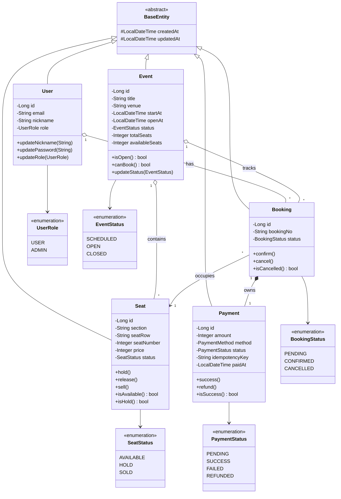
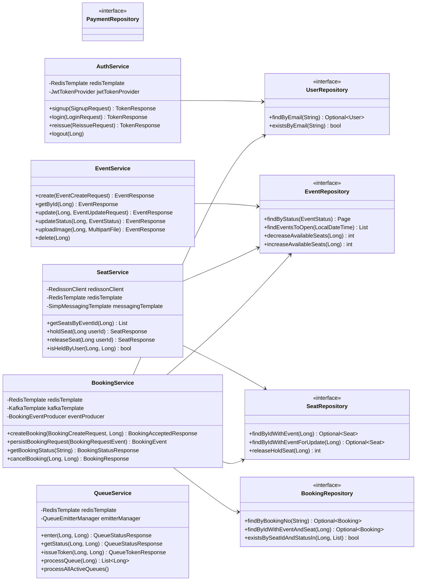

# Class Diagram — Ticketing System

---

## 1. Entity Model



---

## 2. Service · Repository Layer



---

## 3. Controller · Infrastructure Layer

```mermaid
classDiagram
    direction TB

    %% ── Controllers ───────────────────────────────────────────────

    class AuthController {
        POST /api/auth/signup → 201
        POST /api/auth/login → 200
        POST /api/auth/reissue → 200
        POST /api/auth/logout → 200
    }

    class EventController {
        GET  /api/events → 200
        GET  /api/events/{id} → 200
        POST /api/events → 201
        PUT  /api/events/{id} → 200
        PATCH /api/events/{id}/status → 200
    }

    class SeatController {
        GET    /api/events/{id}/seats → 200
        POST   /api/seats/{id}/hold → 200
        DELETE /api/seats/{id}/hold → 200
    }

    class BookingController {
        POST /api/bookings → 202
        GET  /api/bookings/status/{no} → 200
        POST /api/bookings/{id}/cancel → 200
        GET  /api/bookings/my → 200
    }

    class QueueController {
        POST /api/queue/enter → 200
        GET  /api/queue/status → 200
        GET  /api/queue/stream → SSE
        POST /api/queue/token → 200
    }

    %% ── Kafka ─────────────────────────────────────────────────────

    class BookingRequestConsumer {
        <<@KafkaListener booking-requests>>
        +consume(BookingRequestEvent)
    }

    class BookingEventProducer {
        <<booking-events>>
        +send(BookingEvent) CompletableFuture
    }

    class KafkaConfig {
        <<@Configuration>>
        bookingRequestsTopic : partitions=10
        bookingEventsTopic   : partitions=5
        bookingRequestsDlqTopic
        bookingEventsDlqTopic
        DefaultErrorHandler  : FixedBackOff(1s × 3)
        DeadLetterPublishingRecoverer
    }

    %% ── Redis 인프라 ───────────────────────────────────────────────

    class RedisKeyExpirationListener {
        <<@Component keyevent:expired>>
        +onMessage(Message)
    }

    class JwtTokenProvider {
        +createAccessToken(Long, String) String
        +createRefreshToken(Long) String
        +validateToken(String) bool
        +getUserId(String) Long
    }

    %% 컨트롤러 → 서비스
    AuthController    --> AuthService
    EventController   --> EventService
    SeatController    --> SeatService
    BookingController --> BookingService
    QueueController   --> QueueService

    %% Kafka 흐름
    BookingService          --> BookingRequestConsumer  : publishes to\nbooking-requests
    BookingRequestConsumer  --> BookingService          : persistBookingRequest()
    BookingRequestConsumer  --> BookingEventProducer    : downstream
    BookingService          --> BookingEventProducer    : cancelBooking()
    BookingRequestConsumer  ..> KafkaConfig             : uses error handler

    %% Redis 자동 해제
    RedisKeyExpirationListener --> SeatRepository : seat:hold TTL expiry\n→ auto-release
```

---

## Redis Key Map

| Key Pattern | 보유 서비스 | TTL |
|---|---|---|
| `auth:refresh:{userId}` | AuthService | 7일 |
| `queue:event:{eventId}` | QueueService | - |
| `queue:token:{userId}:{eventId}` | QueueService | 10분 |
| `seat:hold:{seatId}` | SeatService | 5분 |
| `seat:lock:{seatId}` | SeatService (Redisson) | 10초 |
| `booking:status:{bookingNo}` | BookingService | 10분 |
