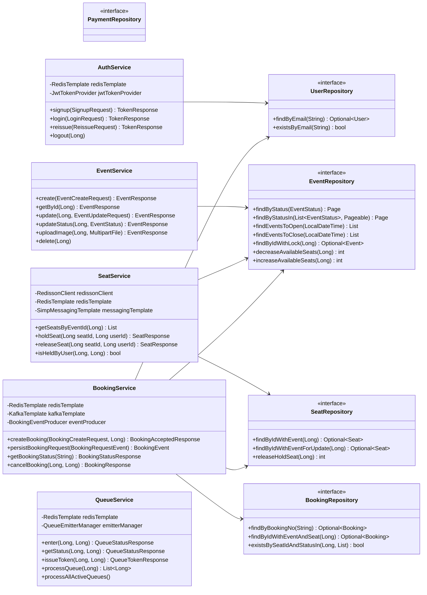
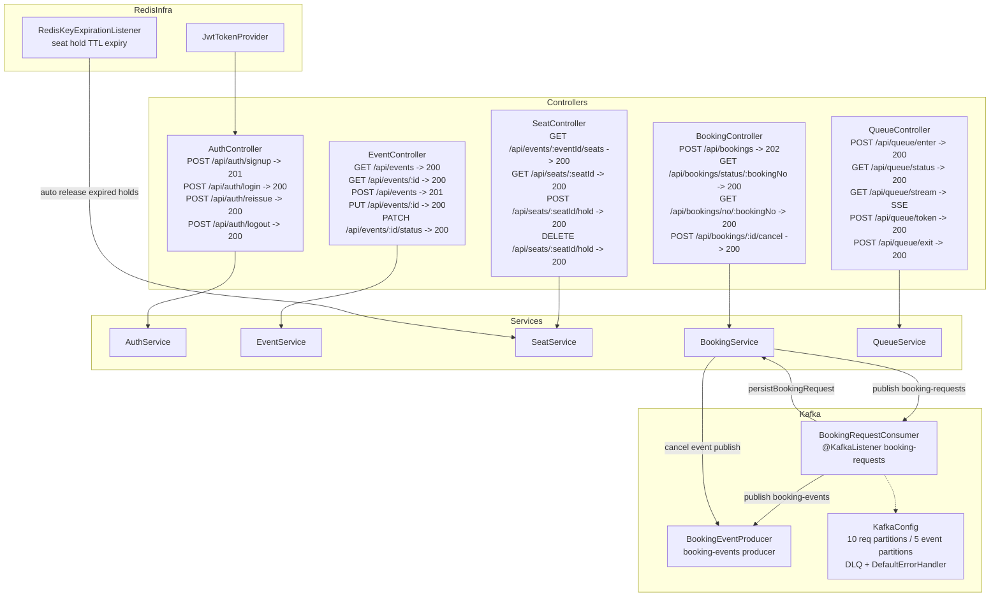

# Class Diagram — Ticketing System

---

## 1. Entity Model

---

## 2. Service · Repository Layer

---

## 3. Controller · Infrastructure Layer

---

## Redis Key Map

| Key Pattern | 보유 서비스 | TTL |
|---|---|---|
| `auth:refresh:{userId}` | AuthService | 7일 |
| `queue:event:{eventId}` | QueueService | - |
| `queue:token:{userId}:{eventId}` | QueueService | 10분 |
| `seat:hold:{seatId}` | SeatService | 5분 |
| `seat:lock:{seatId}` | SeatService (Redisson) | 10초 |
| `booking:status:{bookingNo}` | BookingService | 10분 |
