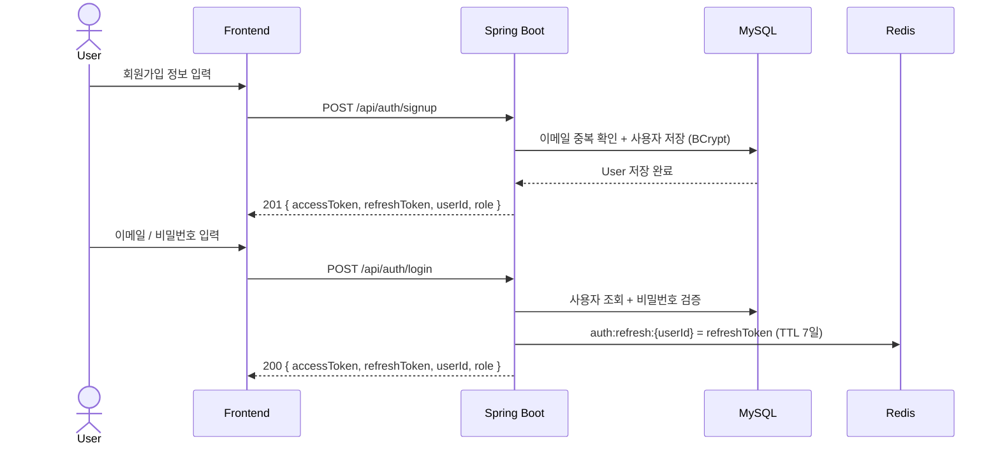
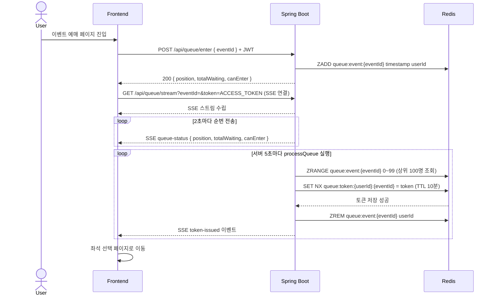
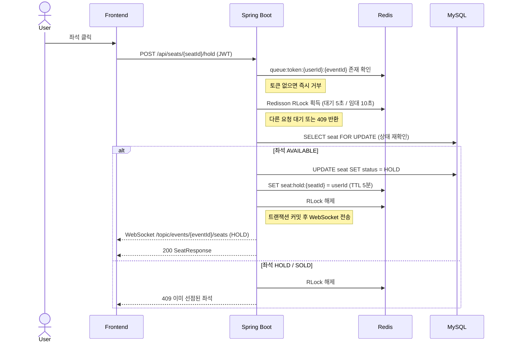
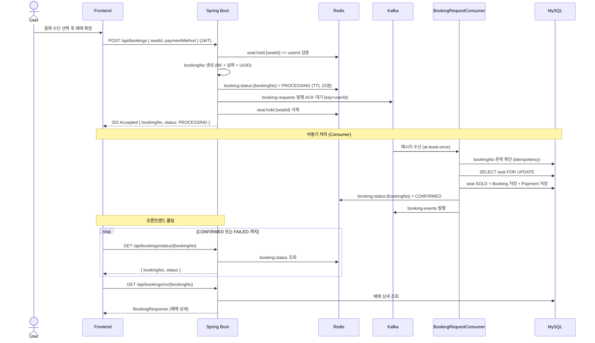
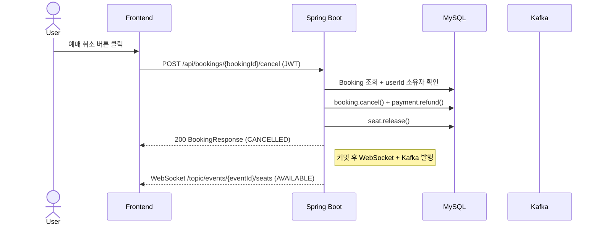
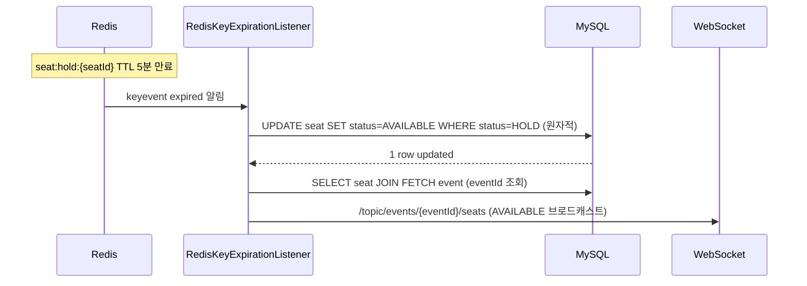

# 시퀀스 다이어그램

사용자 시점의 전체 예매 흐름을 단계별로 정리한 다이어그램.

---

## 1. 회원가입 / 로그인

---

## 2. 대기열 진입 및 입장 토큰 발급 ([SSE](https://www.notion.so/SSE-36c05755fb8780b78318f699da2c1628?source=copy_link))

---

## 3. 좌석 선점 ([WebSocket / STOMP](https://www.notion.so/WebSocket-STOMP-36c05755fb8780c09420f763293a2d65?source=copy_link))

---

## 4. 예매 요청 (비동기)

---

## 5. 예매 취소

---

## 6. 좌석 선점 자동 해제 (TTL 만료)

