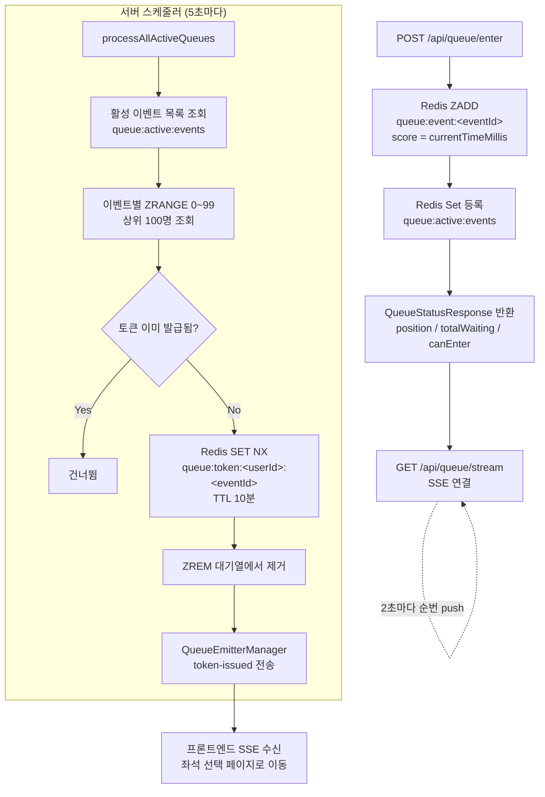
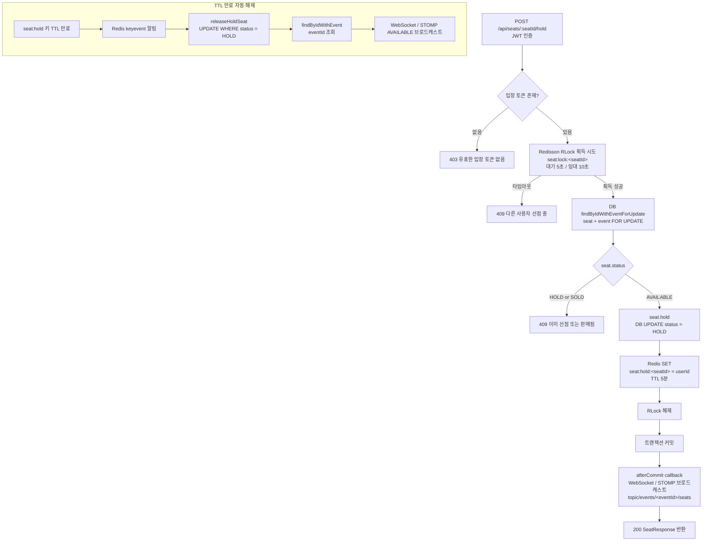
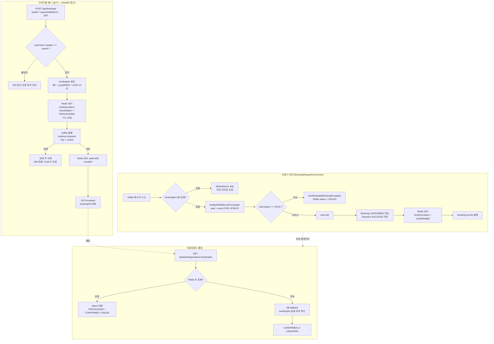
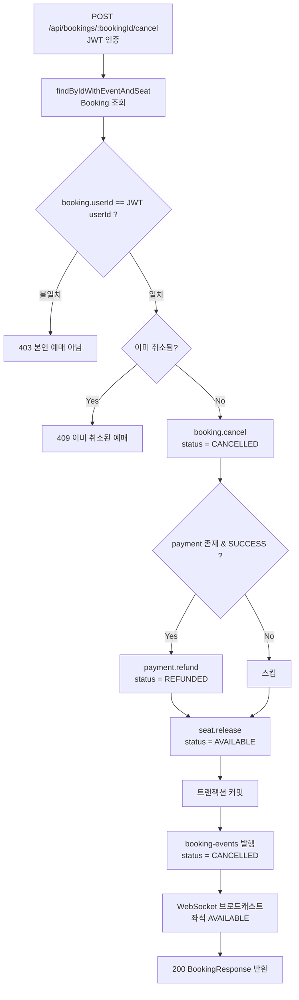
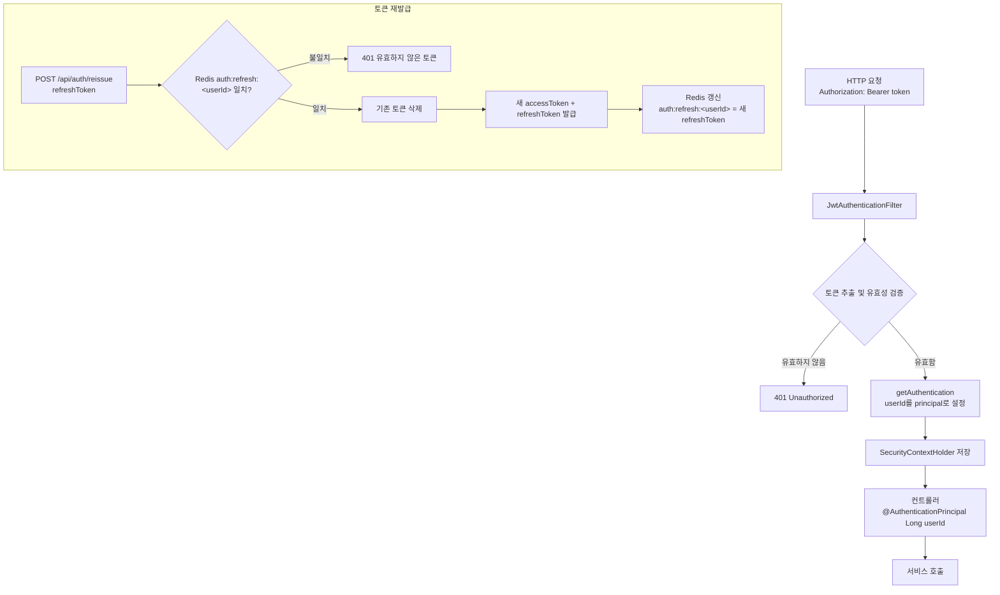

# 서비스 플로우

핵심 기능별 내부 처리 흐름 정리.

---

## 1. 대기열 시스템

Redis Sorted Set 기반의 가상 대기열. [SSE](https://www.notion.so/SSE-36c05755fb8780b78318f699da2c1628?source=copy_link)로 순번 변화를 push해 좌석 선점 페이지의 과부하를 방지한다.

**핵심 설계 포인트**
- `SET NX` (setIfAbsent): 다중 서버 인스턴스 환경에서 토큰 중복 발급 방지
- [`SSE`](https://www.notion.so/SSE-36c05755fb8780b78318f699da2c1628?source=copy_link) + `QueueEmitterManager`: 서버 Push로 클라이언트 폴링 부하 제거
- 대기열 키에 TTL 없음 → 이벤트 종료 시 관리자가 `clearQueue()` 호출

---

## 2. 좌석 선점 (분산락)

[Redisson](https://www.notion.so/Redisson-36c05755fb8780b89412fae09e10d6c9?source=copy_link) 분산락과 [Pessimistic Lock](https://www.notion.so/Pesimisstic-lock-36c05755fb878098b242d34cfcb0373a?source=copy_link)을 함께 사용해 동시 요청을 직렬화한다. 선점 정보는 Redis의 [TTL / Keyspace Notification](https://www.notion.so/Redis-TTL-Keyspace-Notification-36c05755fb87800cb4cfef7e3ba08be3?source=copy_link)을 이용해 5분 후 자동 해제를 지원한다.

**핵심 설계 포인트**
- 락 획득 후 DB 재조회: 락 대기 중 다른 요청이 상태를 변경했을 수 있으므로 재확인 필수
- [`afterCommit`](https://www.notion.so/afterCommit-36c05755fb87807d8ed2d7b70cf9a545?source=copy_link) [WebSocket / STOMP](https://www.notion.so/WebSocket-STOMP-36c05755fb8780c09420f763293a2d65?source=copy_link) 전송: 트랜잭션 롤백 시 클라이언트에 유령 HOLD 전달 방지
- `releaseHoldSeat` 원자적 UPDATE: TTL 만료와 예매 처리 동시 발생 시 double-release 방지

---

## 3. 예매 요청 (비동기 — [Kafka](https://www.notion.so/Kafka-36c05755fb878076a9a1dd6328913883?source=copy_link))

DB 쓰기를 크리티컬 패스에서 제거해 높은 처리량을 달성한다. 요청 수락은 Redis만으로 처리하고 실제 저장은 Consumer가 담당한다.

**핵심 설계 포인트**
- `userId` 파티션 키: 같은 사용자의 요청이 같은 파티션으로 → 순서 보장
- hold 키 삭제를 Kafka 발행 성공 후로 지연: 발행 전 크래시 시 영구 HOLD 잔류 방지
- [`DefaultErrorHandler / DLQ`](https://www.notion.so/DLQ-DefaultErrorHandler-36c05755fb8780749b62f0e778699920?source=copy_link): 시스템 예외는 1초 간격 3회 재시도 후 `.DLQ` 격리
- 비재시도 예외(`NonRetryableBookingException`): `FAILED`로 마감하고 같은 메시지를 반복 재소비하지 않음

---

## 4. 예매 취소 (동기)

취소는 경합이 없으므로 비동기화 없이 `@Transactional` 하나로 처리한다.

---

## 5. JWT 인증 흐름

