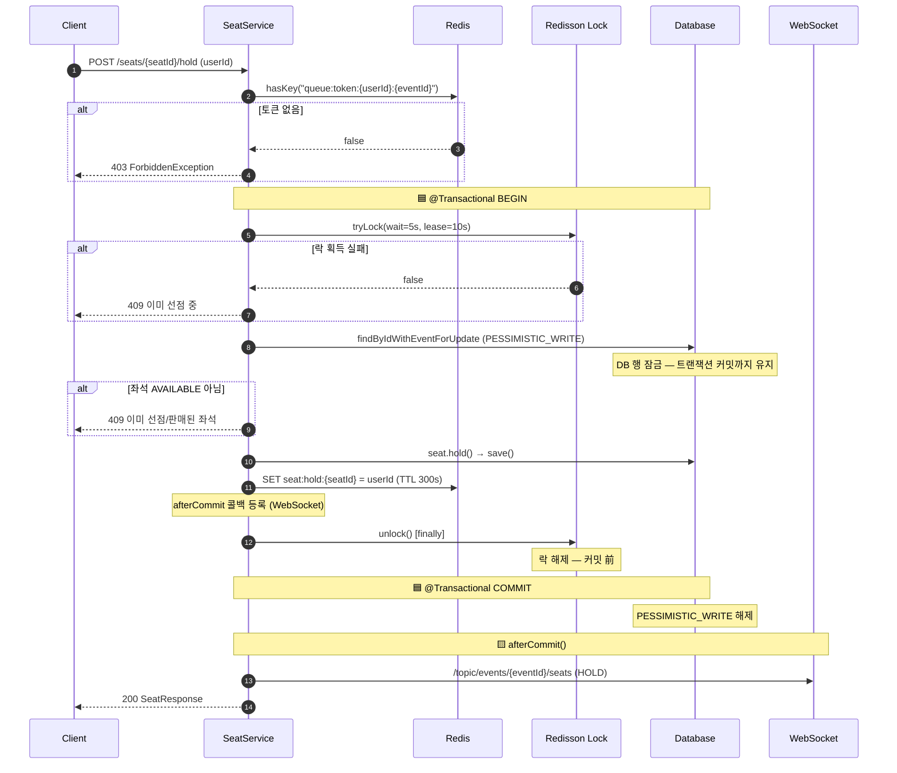
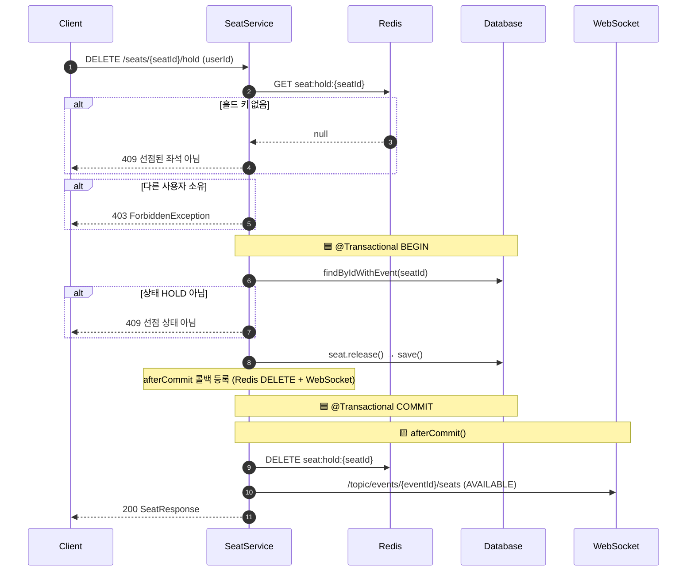
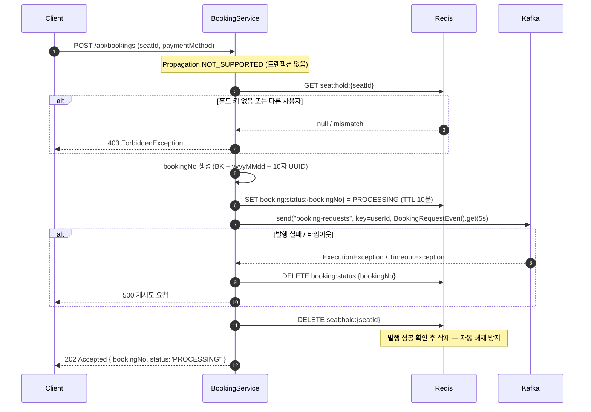
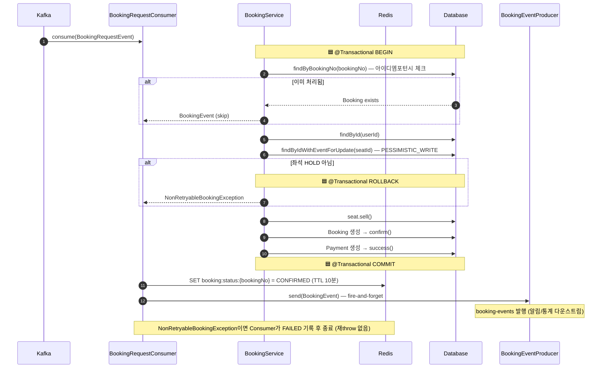
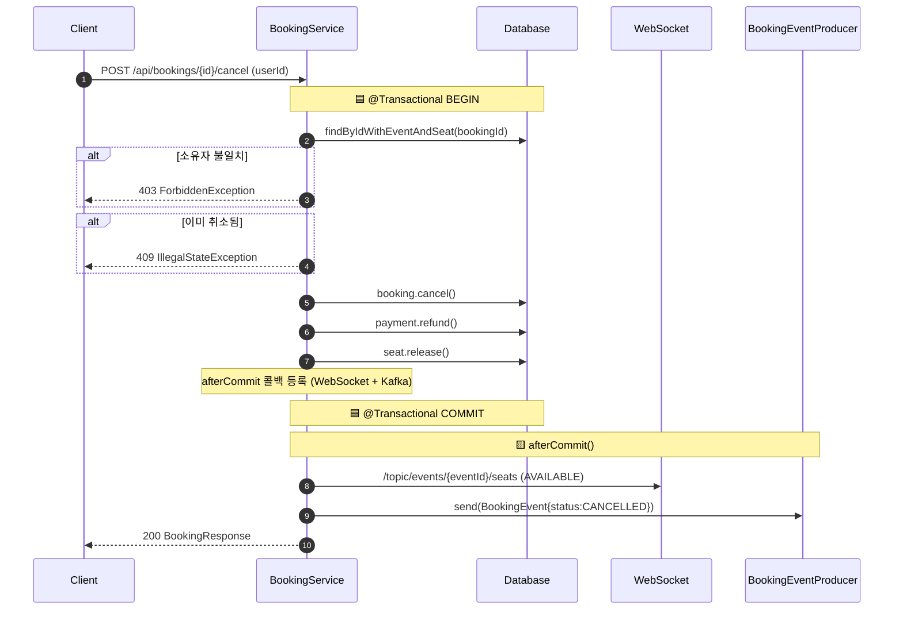
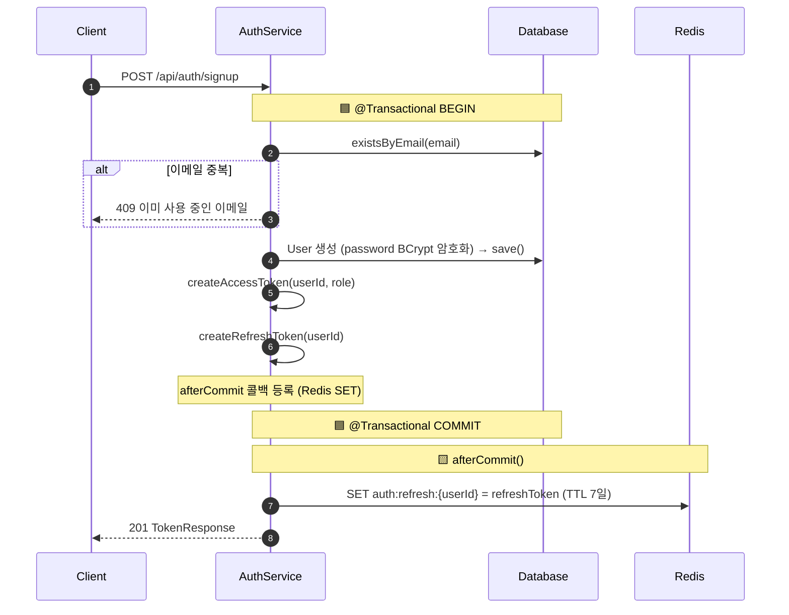
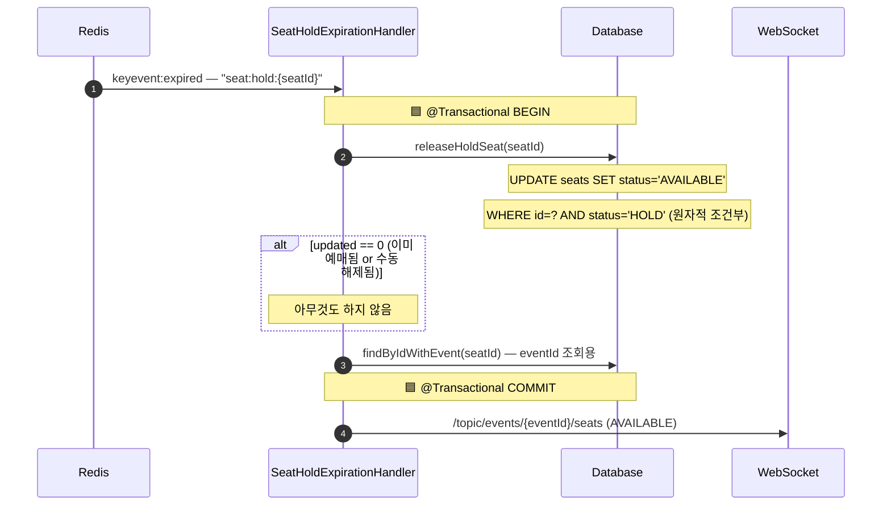

# Transaction Flows — Ticketing System

> **범례**
> - 🟦 `@Transactional` 경계 (DB 커밋/롤백 단위)
> - 🟨 `afterCommit()` 훅 (커밋 성공 후 실행)
> - 🟥 에러 / 예외 경로

---

## 1. 좌석 선점 — `SeatService.holdSeat()`

분산락(Redisson) + DB 비관적 락(PESSIMISTIC_WRITE)을 조합해 이중 선점을 방지한다.
락 해제 → Spring 커밋 사이 창을 DB 행 잠금으로 닫는다.

---

## 2. 좌석 해제 — `SeatService.releaseSeat()`

Redis 홀드 키 삭제를 `afterCommit()`으로 지연한다.
커밋 전 삭제 시 DB 롤백이 발생하면 키는 없고 DB는 HOLD → 좌석 영구 잠김.

---

## 3. 예매 요청 — `BookingService.createBooking()`

DB를 건드리지 않으므로 트랜잭션 없이 실행한다 (`Propagation.NOT_SUPPORTED`).
Kafka 발행 ACK를 동기 대기 후에만 홀드 키를 삭제해 좌석 영구 HOLD를 방지한다.

---

## 4. 예매 영속화 — `BookingRequestConsumer → BookingService.persistBookingRequest()`

Consumer가 DB 쓰기를 담당한다. `bookingNo` 중복 체크로 at-least-once 재처리에 안전하다.

---

## 5. 예매 취소 — `BookingService.cancelBooking()`

취소는 동시성 경합이 없으므로 동기 트랜잭션으로 처리한다.
Kafka 발행을 `afterCommit()`으로 지연해 롤백 시 CANCELLED 이벤트 오발행을 막는다.

---

## 6. 회원가입 — `AuthService.signup()`

리프레시 토큰 저장을 `afterCommit()`으로 지연해 DB 롤백 시 7일 토큰 잔류를 방지한다.

---

## 7. Redis TTL 만료 자동 해제 — `RedisKeyExpirationListener`

사용자가 선점 후 5분 내 예매하지 않으면 Redis TTL 만료 이벤트로 좌석을 자동 해제한다.

---

## 흐름 요약

| 기능 | 트랜잭션 | Redis 조작 타이밍 | Kafka |
|---|---|---|---|
| 좌석 선점 | `@Transactional` | SET — 커밋 **전** (TTL 자가치유) | — |
| 좌석 해제 | `@Transactional` | DELETE — `afterCommit()` | — |
| 예매 요청 | 없음 (`NOT_SUPPORTED`) | DELETE — Kafka ACK 후 | 발행 후 ACK 대기 (5s) |
| 예매 영속화 | `@Transactional` (Consumer) | SET CONFIRMED — 커밋 후 | 다운스트림 발행 |
| 예매 취소 | `@Transactional` | — | `afterCommit()` 발행 |
| 회원가입 | `@Transactional` | SET — `afterCommit()` | — |
| TTL 자동 해제 | `@Transactional` | — (만료 트리거) | — |
